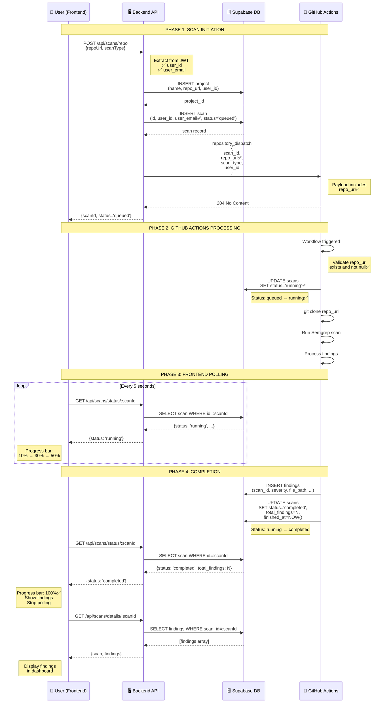

# Complete Scan Flow Diagram

## Key Improvements ✅

### 1. **user_email Now Saved**
- Backend extracts `user_email` from JWT
- Saved in database alongside `user_id`
- Frontend can filter by either field

### 2. **repo_url Included in Payload**
- Payload explicitly includes `repo_url`
- GitHub Actions validates it exists
- Workflow fails early if missing

### 3. **Status Updates to 'running'**
- Old flow: queued → completed
- New flow: queued → **running** ✅ → completed
- Frontend shows accurate progress

### 4. **Complete Logging**
- Backend logs full payload before sending
- GitHub Actions logs received values
- Easy to debug if something fails

## Status Progression Timeline

```
T+0s     User clicks "Start Scan"
         Status: None

T+1s     Backend creates scan
         Status: QUEUED (10% progress)
         ↓
T+3s     GitHub Actions starts
         Status: RUNNING (30-50% progress) ✅ NEW
         ↓
T+45s    Semgrep completes, findings uploaded
         Status: COMPLETED (100% progress)
```

## Database Schema Changes

### Before:
```sql
CREATE TABLE scans (
  id UUID PRIMARY KEY,
  user_id UUID NOT NULL,
  -- user_email missing ❌
  status TEXT NOT NULL,
  ...
);
```

### After:
```sql
CREATE TABLE scans (
  id UUID PRIMARY KEY,
  user_id UUID NOT NULL,
  user_email TEXT,  -- ✅ NEW
  status TEXT NOT NULL,
  ...
);

CREATE INDEX idx_scans_user_email ON scans(user_email);  -- ✅ NEW
```

## GitHub Actions Payload

### Before (Implicit):
```json
{
  "event_type": "scan-request",
  "client_payload": {
    "scan_id": "...",
    "repo_url": "...",  // Not validated ❌
    "scan_type": "fast"
  }
}
```

### After (Explicit + Validated):
```json
{
  "event_type": "scan-request",
  "client_payload": {
    "scan_id": "...",
    "repo_url": "https://github.com/...",  // ✅ Logged & Validated
    "scan_type": "fast",
    "user_id": "...",
    "triggered_at": "2025-11-03T..."
  }
}
```

Workflow validates:
```yaml
if [ -z "$REPO_URL" ] || [ "$REPO_URL" == "null" ]; then
  echo "❌ No repo_url provided"
  exit 1  # ✅ Fail early
fi
```

## Backend Logging

### Before:
```
✅ GitHub Actions workflow triggered successfully
```

### After:
```
📦 Repository scan request - URL: https://github.com/..., User: user@example.com
🚀 Triggering GitHub Actions scan for scanId: xxx
📦 Repository URL: https://github.com/...  ✅ NEW
📤 Sending payload: {
  "scan_id": "...",
  "repo_url": "https://github.com/...",  ✅ NEW
  "scan_type": "fast",
  "user_id": "...",
  "triggered_at": "..."
}
✅ GitHub Actions workflow triggered successfully
📋 Response status: 204  ✅ NEW
```

## Frontend Progress Bar

### Before:
```
┌────────────────────────────┐
│ Scanning... 10%            │  ← Stuck here until complete
└────────────────────────────┘
```

### After:
```
┌────────────────────────────┐
│ Queued... 10%              │  ← Initial state
└────────────────────────────┘
         ↓
┌────────────────────────────┐
│ Running... 30%             │  ← ✅ NEW - Shows progress
└────────────────────────────┘
         ↓
┌────────────────────────────┐
│ Running... 50%             │  ← ✅ NEW - Realistic progress
└────────────────────────────┘
         ↓
┌────────────────────────────┐
│ Completed! 100%            │  ← Final state
│ 5 findings found           │
└────────────────────────────┘
```

## Error Handling Improvements

### Scenario 1: Missing repo_url

**Before:** Workflow fails silently or clones nothing
```
git clone $REPO_URL  # Empty variable, no error
```

**After:** Workflow fails immediately with clear message
```yaml
if [ -z "$REPO_URL" ]; then
  echo "❌ repo_url is required"
  exit 1
fi
```

### Scenario 2: Invalid repo_url

**Before:** Generic error
```
fatal: could not read from repository
```

**After:** Specific error and status update
```yaml
if ! git clone "$REPO_URL"; then
  echo "❌ Failed to clone $REPO_URL"
  # Update scan to failed status
  exit 1
fi
```

### Scenario 3: No user_email in database

**Before:** Frontend might crash if filtering by email

**After:** Migration backfills all existing records
```sql
UPDATE scans s
SET user_email = u.email
FROM user_profiles u
WHERE s.user_id = u.id
  AND s.user_email IS NULL;
```

## Routes Verification

All routes properly mounted and accessible:

```
✅ GET  /health                 → Server health check
✅ GET  /api/health             → API health check
✅ POST /api/scans/repo         → Trigger scan (requires auth)
✅ GET  /api/scans/list         → Get user scans (requires auth)
✅ GET  /api/scans/status/:id   → Get scan status (requires auth)
✅ GET  /api/scans/details/:id  → Get scan + findings (requires auth)
✅ GET  /api/reports/list       → Get reports (requires auth)
```

Test script confirms all routes accessible on Render.
